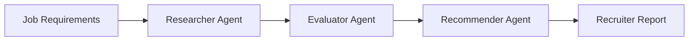

# Recruitment Assistant

## Project Title and Description

The Recruitment Assistant is an AI-powered multi-agent recruiting tool that helps recruiters source, evaluate, and prioritize candidates for a role using a structured, explainable workflow. The product accepts a job requirement, analyzes candidate fit, and produces a ranked shortlist with rationale for recruiter review.

This project is designed to reduce manual recruiting effort while keeping decision-making in human hands. It is intended to help recruiters find qualified candidates faster, compare them consistently, and prepare a stronger shortlist with less context switching and less spreadsheet-heavy work.

### Value proposition

- Faster candidate screening and shortlist creation
- More consistent candidate evaluation across roles
- Clear explanations behind recommended matches
- Reduced dependency on manual sourcing workflows
- Safe, human-reviewed recruiting support for an internal MVP

---

## Problem Statement

Recruiting teams still spend a large share of their time on repetitive work: sourcing candidates, reviewing profiles, comparing qualifications, and manually preparing shortlist recommendations. This process is slow, inconsistent, and difficult to scale when hiring demand increases or multiple hiring managers are involved.

Manual recruitment is especially inefficient because it relies on fragmented systems and repeated comparison work. Recruiters must often move between job descriptions, ATS data, public search, email, and individual candidate profiles to build a coherent recommendation. The result is slower hiring cycles, inconsistent candidate quality, and a heavier burden on recruiters.

This project solves that problem by using a structured multi-agent workflow to automate the most time-consuming parts of the screening and recommendation process while keeping recruiters in the decision loop.

---

## Features

### Core capabilities

- Candidate search based on job requirements
- Automated candidate evaluation against role criteria
- Ranked candidate recommendations with rationale
- Recruiter-ready markdown shortlist report
- Synthetic or fixture-based candidate data for safe demo usage
- Human-in-the-loop review before outreach or hiring decisions

### What users can expect

- A fast path from job brief to shortlist
- More transparent explanation of why a candidate is recommended
- Better decision support for recruiters and hiring managers
- Lower operational overhead compared with purely manual sourcing workflows

---

## Architecture Overview

The application is built around a collaborative multi-agent workflow. The system uses a sequential crew where each agent focuses on a different stage of recruiting.



### Agent roles and responsibilities

**Researcher Agent**
- Finds or gathers candidate information
- Uses approved sources and optional operator-supplied profiles
- Produces a candidate pool for evaluation

**Evaluator Agent**
- Assesses each candidate against the role criteria
- Produces match scores and written reasoning
- Highlights strengths, gaps, and risk areas

**Recommender Agent**
- Ranks candidates by fit and evidence
- Provides the best recommendations for recruiter review
- Prepares the shortlist narrative for human action

### How the agents collaborate

The agents work as a coordinated pipeline: the Researcher gathers candidate context, the Evaluator scores fit, and the Recommender prioritizes the strongest matches into a recruiter-ready output. This keeps the system explainable and easier to reason about than a single opaque screening step.

---

## Getting Started

### Prerequisites

Before running the project, ensure you have:

- Python 3.11+
- pip or uv
- A valid OpenAI API key
- Optional: Serper API key for search-enabled demo mode
- A local development environment for running the application and tests

### Installation

```bash
git clone <repository-url>
cd recruitment-assistant
python -m venv .venv
source .venv/bin/activate
```

Windows PowerShell:

```powershell
python -m venv .venv
.\.venv\Scripts\Activate.ps1
```

Install the project dependencies after the Build phase scaffolding is in place:

```bash
pip install -r requirements.txt
```

Set environment variables as needed:

```bash
export OPENAI_API_KEY="your-key"
export OPENAI_MODEL="gpt-4o"
# optional
export SERPER_API_KEY="your-serper-key"
export AAMAD_ENABLE_WEB_RESEARCH="false"
```

### Basic usage

The app is intended to be used in the following way once the Build phase is complete:

1. Enter a job description or role requirements
2. Optionally provide candidate profiles or fixture data
3. Run the multi-agent workflow
4. Review the ranked recommendations and rationale
5. Use the generated report as a recruiter decision-support artifact

This usage is preliminary and will be finalized in the Build phase.

---

## Project Structure

This repository follows the AAMAD structure and keeps product and implementation artifacts organized by phase.

```text
recruitment-assistant/
├── AGENTS.md
├── CHECKLIST.md
├── README.md
├── aamad.config.example.yml
├── project-context/
│   └── 1.define/
│       ├── mrd.md
│       └── prd.md
├── .cursor/
│   ├── agents/
│   ├── prompts/
│   ├── rules/
│   └── templates/
├── .github/
├── .vscode/
├── src/
├── app/
├── tests/
├── .env.example
├── requirements.txt
├── pyproject.toml
├── .gitignore
└── docs/
```

### Key artifacts and locations

- project-context/1.define/: MRD and PRD definitions for the current phase
- .cursor/: AAMAD agent and rule definitions
- src/: backend implementation for the recruitment workflow
- app/: frontend or UI layer for recruiter interaction
- tests/: QA and validation coverage
- docs/: supporting documentation and future project notes

---

## Development Status

### Current phase

This project is currently in the Define phase of the AAMAD lifecycle.

### Completed

- Product and market research completed
- PRD drafted and aligned to the project scope
- Recruitment assistant problem, goals, and MVP boundaries defined
- Role and architecture decisions captured for the upcoming Build phase

### Next

- Build the CrewAI application and agent definitions
- Implement recruiter-facing workflow and UI flow
- Add fixture-based candidate data and QA coverage
- Validate security and compliance guardrails
- Prepare for the Deliver phase once the MVP is tested

---

## Development Notes

The current product scope intentionally keeps the MVP focused and safe:

- no full ATS integration
- no candidate communication automation
- no advanced analytics reporting in the mini-project
- no automated hiring decisions
- human review remains required throughout the workflow

This keeps the project practical for a first implementation while leaving a clear path for future growth.
